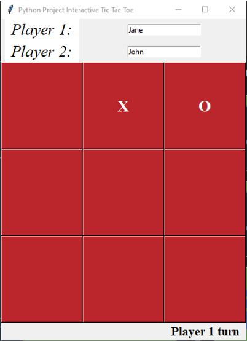

# TicTacToe-GUI
Just a tic tac toe game I made when I was learning tkinter.

## The game looks something like this



## Importing libraries
```python
# importing libraries
from tkinter import *
import tkinter.messagebox
```

## Making a tkinter object and giving the frame a title
```python
tk = Tk()
tk.title("Python Project Interactive Tic Tac Toe")
```

## Making string variables to save player names.
```python
p1 = StringVar()
p2 = StringVar()
```

## Making text field so that players can enter their names
```python
player1_name = Entry(tk, textvariable=p1)
player1_name.grid(row=1, column=1, columnspan=10)
player2_name = Entry(tk, textvariable=p2)
player2_name.grid(row=2, column=1, columnspan=10)
```

## Making a player_turn variable that will determine whose turn is it.
```python
player_turn = 1
```
## Making a flag to determine if the game is a draw.
```python
flag = 0
```

## Method to check if any of the player has won
```python
# defining Check for win function
def checkForWin(buttons):
    # importing some global variables. such as player names and flag
    global player1_name, player2_name, flag
    # winning patterns is a list of lists that contain the winning patterns such as
    # [1,2,3] means that if there is an "X" or "O" at all three of these places the
    # player will win. Just like that there are total of 8 winning patterns
    winning_patterns = [[1,2,3],[4,5,6],[7,8,9],
                        [1,5,9],[3,5,7],[1,4,7],
                        [2,5,8],[3,6,9]]
    
    # iterating through winning_patterns.
    for winning_pattern in winning_patterns:
        # making an p1_wins and p2_wins empty list
        p1_wins, p2_wins = [], []
        for point in winning_pattern:
            # if the point in winning_pattern has "X" append True it to p1_wins list 
            p1_wins.append(buttons[point -1]["text"] == "X")
            # if the point in winning_pattern has "O" append True it to p2_wins list 
            p2_wins.append(buttons[point -1]["text"] == "O")
            
        # if all the entries of p1_wins is true meaning that it has satisfies that 
        # winning_Pattern then declare p1 as the winnner.
        if all(p1_wins):
            # display a message box that congrats the p1 of his victory
            tkinter.messagebox.showinfo("Match Status", "{} Wins!".format(player1_name.get()))
            # set all the text on the buttons to " "
            disableButton(buttons)
            flag = 0
        # if all the entries of p2_wins is true meaning that it has satisfies that 
        # winning_Pattern then declare p2 as the winnner.
        if all(p2_wins):
            # display a message box that congrats the p2 of his victory
            tkinter.messagebox.showinfo("Match Status", "{} Wins!".format(player2_name.get()))
            # set all the text on the buttons to " "
            disableButton(buttons)
            flag = 0
            
    # check if the value of flag is 8 then declare the amtch as a draw.
    if flag == 8:
        # display a message box that displays tie.
        tkinter.messagebox.showinfo("Tic-Tac-Toe", "It is a Tie")
        disableButton(buttons)
        flag = 0
```
## Method to disable all the buttons. This is used to reset the board.
```python
# defining disable button module
def disableButton(buttons):
    # iterate through the list of buttons
    for button in buttons:
        # set the text on each button as " "
        button.configure(text = " ")
```
## Method that changes the turn label at the tic tac toe game
```python
# defining change turn module
def changeTurn(turn_now):
    global turn
    # change the text on the turn label
    turn.config(text = "Player "+ turn_now + " turn")
```
## Method to change the text of the button depending on which player pressed the button
```python
# defining button pressed module.
def btnPressed(button):
    global player_turn, flag, buttons, turn
    # check if the text on the button that the player pressed is " " and the check for player 1 turn
    if button["text"] == " " and player_turn == 1:
        # set the text to "X" i.e the mark of the player 1
        button["text"] = "X"
        # now set the player_turn variable to 2 as the next turn is of player 2
        player_turn = 2
        # call the checkForWin module
        checkForWin(buttons)
        # change the turn label
        changeTurn(str(player_turn));
        flag += 1

    # check if the text on the button that the player pressed is " " and the check for player 2 turn 
    elif button["text"] == " " and player_turn == 2:
        # set the text to "O" i.e the mark of the player 2
        button["text"] = "O"
        # now set the player_turn variable to 1 as the next turn is of player 1
        player_turn = 1
        # call the checkForWin module
        checkForWin(buttons)
        # change the turn label
        changeTurn(str(player_turn));
        flag += 1
    # if the button is already marked with an "X" or an "O" then prompt the player that this button is already clicked.
    else:
        tkinter.messagebox.showinfo("Tic-Tac-Toe", "This Button is already Clicked!")
```
## Setting frame, labels, and buttons
```python
# make a label for Player 1
label = Label( tk, text="Player 1:", font='Times 20 italic', bg='white', fg='black', height=1, width=8)
label.grid(row=1, column=0)

# make a label for Player 2
label = Label( tk, text="Player 2:", font='Times 20 italic', bg='white', fg='black', height=1, width=8)
label.grid(row=2, column=0)

# make a buttons list
buttons = []
# use nested loops to make a grid of buttons
for row in range(3,6):
    for column in range(3):
        # make a button with empty text and font size of 20 and font 
        # face of Times New Roman with a background color of #ba262b
        btn = Button(tk, text=" ", font='Times 20 bold', bg='#ba262b',
                    fg='white', height=4, width=8)
        # stacking the button to grid
        btn.grid(row = row, column = column, sticky=N+S+E+W)
        # binding the btnPressed to the command of the button
        btn["command"] = lambda btn=btn: btnPressed(btn)
        # appending the button to buttons list.
        buttons.append(btn)
# make a label for turn
turn = Label(tk, text= "Player 1 Turn", font='Times 16 bold')
turn.grid(row = 6, column = 2)

# start the main loop
tk.mainloop()
```
